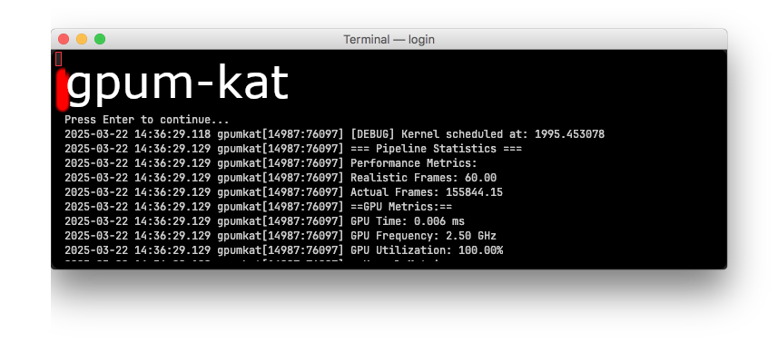
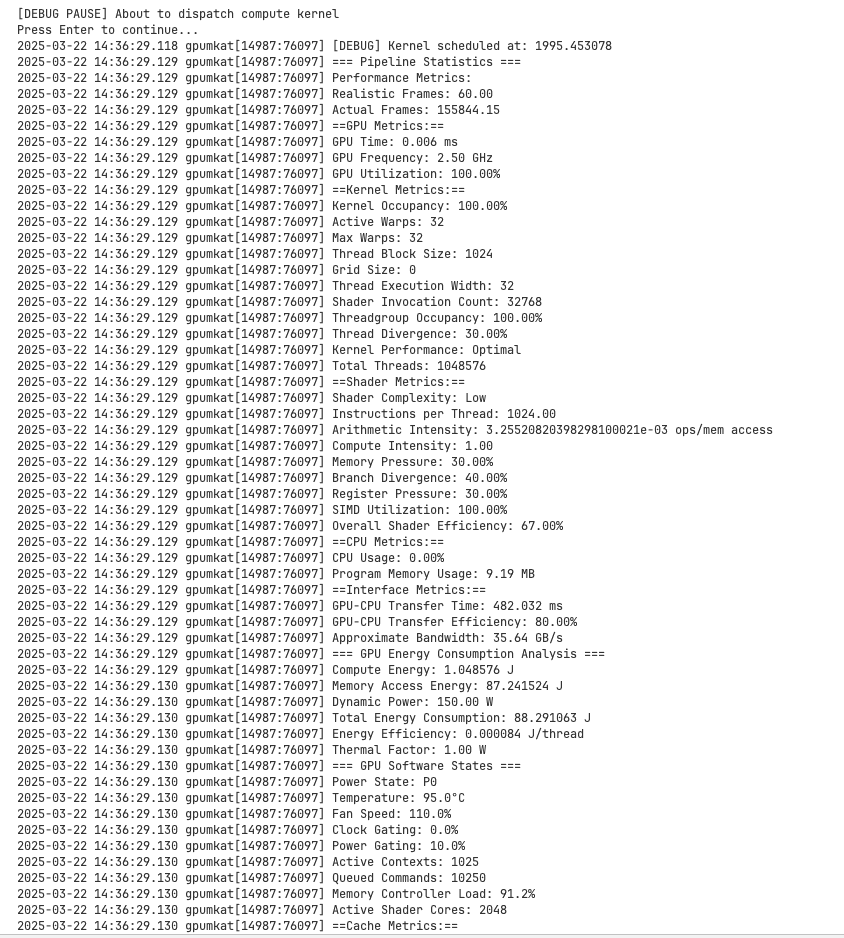

# Gpumkat

### Showcase:


<a href="https://www.youtube.com/watch?v=uRV-N743ZnM"></a>

a GPU kernel analysis tool for macOS Metal with many features ranging from analyzing performance to energy consumption, cache hit rates, interface metrics, gpu software states, shader optimization recommendations, stack traces, recording timelines and traces and more.

## Requirements:

- any platform that supports metal
- metal api
- xcode
- json-c 0.17
- curl

## Installation

To install gpumkat run this command.

```sh
curl -L -o gpumkat.tar.gz https://github.com/MetalLikeCuda/gpumkat/releases/download/%s/gpumkat.tar.gz && tar -xvzf gpumkat.tar.gz && cd gpumkat && sudo sh install.sh
```

replace %s with the latest version

## Usage

```sh
gpumkat <path_to_config_file>
```

---
### Commands you can use

**To update**

```sh
gpumkat -update
```

**To add plugins**

```sh
gpumkat -add-plugin <path_to_plugin>
```

**To remove plugins**

```sh
gpumkat -remove-plugin <path_to_plugin>
```

**To get help**

```sh
gpumkat -help
```

**To get version information**

```sh
gpumkat --version
```

## Example config:

```json
{
  "metallib_path": "default.metallib",
  "function_name": "compute_shader",
  "debug": {
    "enabled": true,
    "print_variables": true,
    "step_by_step": true,
    "break_before_dispatch": true,
    "verbosity_level": 2,
    "breakpoints": [
      {
        "condition": "BeforeDispatch",
        "description": "After buffer initialization"
      }
    ],
    "error_handling": {
      "catch_warnings": true,
      "catch_memory_errors": true,
      "catch_shader_errors": true,
      "catch_validation_errors": true,
      "break_on_error": false,
      "max_error_count": 100,
      "min_severity": 1
    },
    "timeline": {
      "enabled": true,
      "output_file": "gpumkat_timeline2.json",
      "track_buffers": true,
      "track_shaders": true,
      "track_performance": true,
      "max_events": 1000
    },
    "low_end_gpu": {
      "enabled": true,
      "compute": {
        "processing_units_availability": 0.6,
        "clock_speed_reduction": 0.4,
        "compute_unit_failures": 2
      },
      "memory": {
        "bandwidth_reduction": 0.6,
        "latency_multiplier": 3.0,
        "available_memory": 536870912, 
        "memory_error_rate": 0.02
      },
      "thermal": {
        "thermal_throttling_threshold": 85.0,
        "power_limit": 50.0,
        "enable_thermal_simulation": true
      },
      "logging": {
        "detailed_logging": true,
        "log_file_path": "/tmp/low_end_gpu_simulation.log"
      }
    },
    "async_debug": {
      "enable_async_tracking": true,
      "log_command_status": true,
      "detect_long_running_commands": true,
      "long_command_threshold": 2.5,
      "generate_async_timeline": true
    },
    "thread_control": {
      "enable_thread_debugging": true,
      "dispatch_mode": 3,
      "log_thread_execution": true,
      "validate_thread_access": true,
      "simulate_thread_failures": true,
      "thread_failure_rate": 0.05,
      "custom_thread_group_size": [32, 1, 1],
      "custom_grid_size": [1024, 1, 1],
      "thread_order_file": "custom_thread_order.txt"
    }
  },
  "buffers": [
    {
      "name": "inputBuffer",
      "size": 1024,
      "type": "float",
      "contents": [1.0, 2.0, 3.0, 4.0, 5.0]
    },
    {
      "name": "outputBuffer",
      "size": 1024,
      "type": "float",
      "contents": []
    }
  ]
}
```

## Example kernel:

```c
#include <metal_stdlib>
using namespace metal;

kernel void compute_shader(const device float *input [[buffer(0)]],
                           device float *output [[buffer(1)]],
                           uint index [[thread_position_in_grid]]) {
    output[index] = input[index] * 2.0;
}
```

## Example Logs:


## Building

You can build gpumkat using clang with the following command:

```sh
 clang -I/opt/homebrew/Cellar/json-c/0.17/include \
      -L/opt/homebrew/Cellar/json-c/0.17/lib \
      -framework Foundation \
      -framework Metal \
      -framework MetalPerformanceShaders \
      -framework QuartzCore \
      -lcurl \
      -ljson-c \
      main.m modules/plugin_manager/plugin_manager.m modules/debug/debug.m modules/debug/timeline_debug.m modules/update/update.m modules/memory_tracker/memory_tracker.m modules/pipeline_statistics/pipeline_statistics.m -o gpumkat
```

Or with cmake:

```sh
mkdir build
cd build
cmake ..
make
```

### Notes:

Other shaders you can use are located in the list of shaders: https://github.com/MetalLikeCuda/list_of_metal_shaders/tree/main

Some things like temperature are simulated so it's better to just use instruments if you want very low level hardware specific data, though for normal debugging this should be better.
